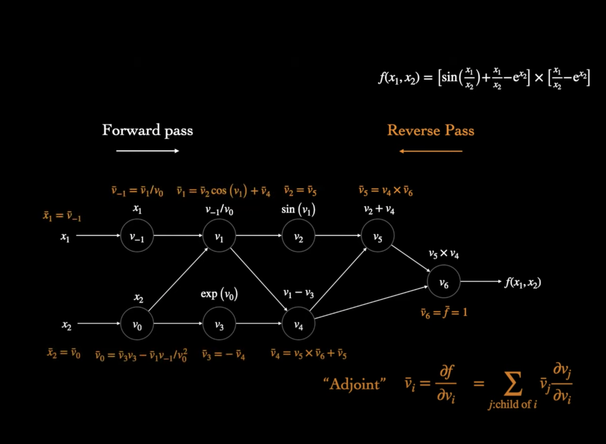
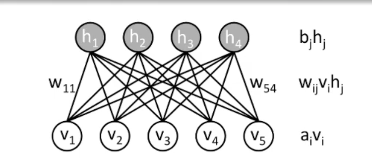

#### Multi layer perceptron

#### Chain rule and backpropagation

#### Automatic differentiation

Types of differentiation compute gradients:
- Numerical Differentiation
- Symbolic Differentitaion
- Automatic Differentiation

- Auto diff keeps track of the computation graph (operators between intermediate variables which form a DAG ) during the forward pass.
- Then update the gradient of node $v_i$ based on its child nodes in the following way:

$ v_i' = \sum v_j' * d v_j / d v_i $

where $v_j'$ is the derivative of output $f$ with respect to child node $v_j$  

<!-- { width: 200px; } -->

#### Hopfield memory model

#### Boltzmann Machines

Given a set of binary vectors, learn a model that can assign a probability to a given binary vector. For example, the binary vector could be the occurence of a word in a document.

Restricted Boltzmann Machine is energey based model, with 2 layers hidden and visible. It is a bipartite interaction graph with no hidden-hidden or visible-visible interactions but only hidden-visible interactions.

The energy function of the network is 

$E(v, h) = - \sum_i a_i * v_i - \sum_j b_j * h_j - \sum_{ij} w_{ij} * v_i * h_j $

where we have bias parameters $a$ and $b$ on visible and hidden neurons.

This can be used to complete incomplete representations of data (e.g images) by minimizing the energy.

Probability density can be defined as $ p(v,h) = e^{-E(v,h)} / Z $

Where partition function is $Z = \sum_{v,h} e^{-E(v,h)}$
 which is usally intractable.

After training, ideally we want the marginalized distribution of $p(v,h)$ over $h$ to match the original distribution $p(v)$

The probability of $v$ can be written as $p(v) = \sum_h p(v/h) $

##### Training

To minimize the energy and maximize probability $p(v)$ let's differentiate log of $p(v)$ with respect to $w_{ij}$ 

The derivative is simple:

$ d \log p(v) / dw_{ij} = \mathbb{E}\_{data}[v_i , h_j] - \mathbb{E}\_{model}[v_i , h_j] $

which is equivalent to:

$ \sum_{j} p(h_j/v) * v_i * h_j $  - $\sum_{v', h} p(v', h) * v'\_i * h_j $

The first term can be calculated easily as:
$p(h_i \| v_j) = \sigma ( b_j + w_{ij} * v_j )$

similarly $ p(v_j \| h_i) = \sigma (a_i + w_{ij} * h_i)$

we can use these two to sample from $p(v,j)$ iteratively:

$ h \sim p(h \| v ) = \sigma ( b + W^T * v )$

$ v' \sim p(v' \| h ) = \sigma (a + W^T * h)$

which is also known as Gibbs sampling.

We can this compute both terms in the derivative and update weights as:

$  w < w + d \log p(v) / d w_{ij} $

##### Applications

RBMs can be used to complete incomplete / corrupt data. In applications such as recommender systems, the user-item interaction matrix is complete ( rating ) for movies already watched.

We can train a RBM to understand the filled user-item interaction matrix. Then we can feed the seen ratings for a user and get an output from RBM that includes filled in values for movies yet to be rated by that user. Thus we can recommend movies with higher rating to that user.

