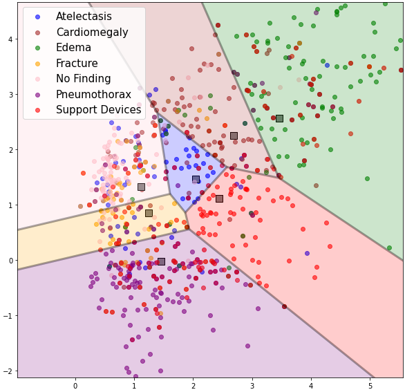
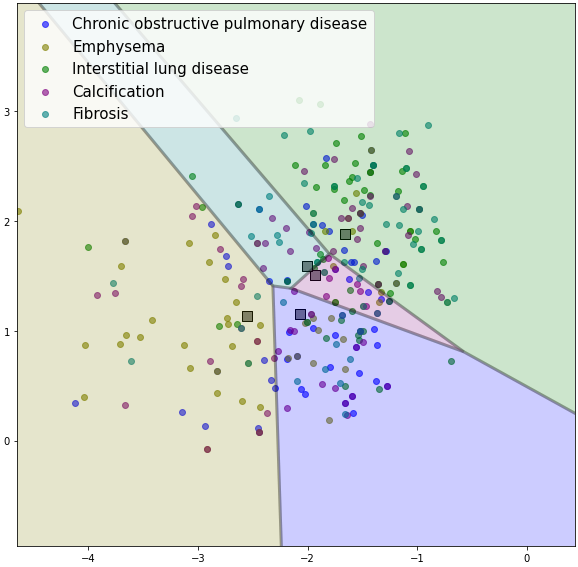

  <table>
    <tr>
      <td> <h5 style="float: left; margin-left:20px"><a href='/'> About Me </a></h5></td> 
      <td> <h5 style="float: left; margin-left:20px"><a href='/projects'> Projects </a></h5></td> 
      <td> <h5 style="float: left; margin-left:20px"><a href='/blog'> Blog </a></h5></td> 
    </tr>
  </table>

### Table of Contents
- [Representation Learning & Efficient AI](#representation-learning--efficient-ai)
  - [Few-shot Learning for Multi-label Classification](#few-shot-learning)
  - [Early Interest and Google Summer of Code](#early-interest-and-google-summer-of-code)
- [Fairness, Bias and Robustness](#fairness-bias-and-robustness)
  - [Fine tuning and Subgroup Robustness for Occupational NER with LLMs](#finetuning-ner)

---

#### Representation Learning & Efficient AI 

#### Few-shot Learning for Multi-label Classification 
<!-- 
During my Master’s, I explored representation learning and efficient AI models under the guidance of [Dr. Mingchen Gao](https://www.mingchengao.com/). My work focused on [few-shot learning for multi-label classification](https://link.springer.com/chapter/10.1007/978-3-031-17027-0_12), applied specifically to diagnosing rare diseases from chest X-ray images using the [MIMIC CXRAY dataset](https://physionet.org/content/mimic-cxr/2.0.0/).

The proposed approach, **DeepVoro Multi-label**, combines multiple representation spaces generated from different feature extractors. I trained these extractors using various techniques, including neighborhood component analysis (NCA) loss, sampling additional support samples from calibrated distributions, and supervised fine-tuning. 

Addressing the challenge of imbalanced multi-label classification—common in medical diagnosis tasks—I adapted the NCA loss to account for label similarity and class imbalance. Additionally, I refined the sampling method by using feature statistics from prevalent diseases to better represent rare conditions. Finally, the multiple representations were merged using softmax probabilities derived from Voronoi diagrams, significantly enhancing classification performance.

This research was conducted in collaboration with radiologists and experts from [Weill Cornell Medicine](https://weill.cornell.edu/), New York.
 -->

Paper: ([MICCAI 2022 - DALI](https://link.springer.com/chapter/10.1007/978-3-031-17027-0_12))
During my Master’s, I pursued my interesting project in representation learning along with efficient AI models during my work with Dr. Mingchen Gao on Few-shot learning for multi-label classification(MICCAI 2022 - DALI) .
I evaluated it using a real-world application for identifying rare diseases in chest x-rays
using few-shot samples and a larger set of samples of common classes using the [MIMIC CXRAY dataset](https://physionet.org/content/mimic-cxr/2.0.0/). 

My method combined representations generated by different feature
extractors trained using techniques such as neighborhood component analysis (NCA)
loss, sampling additional support samples from calibrated distribution, and
supervised fine-tuning. Since most Few-Shot Learning schemes are Voronoi diagrams
in the representation space, Figure 1 (e.g. Prototypical Networks ) I proposed combining the Voronoi diagrams generated from multiple multi-label schemes into our geometric DeepVoro Multi-label ensemble. 

One of the challenges was adapting all of the techniques for imbalanced multi-label problems, as chest X-rays can be attributed to multiple diseases. To solve this, I modified the NCA loss by minimizing the distances
between samples based on the number of positive labels that match between those samples
and added weights for imbalanced classes. For sampling from calibrated distribution, I
calculated the common class feature statistics with all samples with a particular label
as positive. Then we used a weighted binary cross-entropy loss to train a single-layer
classifier on augmented support samples and reduced the weights to a Voronoi diagram in
the representation space. Finally, to combine the representation Voronoi diagrams, I
used a softmax function on distances from cluster centers to get the probability of where
a sample lies from multiple centers in different representation spaces. To extract rare
diseases for our dataset, we collaborated with radiologists and experts from Weill Cornell
Medicine, New York.
<table>
  <tr>
    <td>
      
      <figcaption style="text-align:center;">Voronoi Diagaram in 2D for base classes</figcaption>
    </td>
    <td>
      
      <figcaption style="text-align:center;"> Novel classes </figcaption>
    </td>
  </tr>
</table>

---

##### Early Interest and Google Summer of Code

My interest in AI initially developed during my undergraduate years after being selected to work on summer projects sponsored by Google through the Google Summer of Code 2016 and 2014.  
Collaborating with my mentor Heiko Strathmann, Ph.D., University College London, I implemented efficient algorithms to an [open source Machine Learning project](https://gist.github.com/Saurabh7/b492519a6044a840145824011229a64b).  
I added Locality Sensitive Hashing for approximate nearest neighbors search, Multiple Kernel Learning for Support Vector Machines, and implemented speed-ups for distance computations in feature spaces using parallelization with OpenMP and GPUs in their linear algebra library.

---

#### Fairness, bias and Robustness

I realized the problem of fairness when developing my rare disease classification model and investigated it in my work on **Subgroup intersectional fairness for multi-label Chest X-ray classification** ([ICCV 2023 CVAMD](https://arxiv.org/pdf/2403.18196)). Collaborating with fellow students from the Physionet Team at [MIT LCP](https://lcp.mit.edu/physionet) we linked MIMIC-CXR to MIMICIV and MIMIC-SDOH data sets to create subgroups using health insurance and
income combined with race, forming eight distinct intersectional groups and measuring intersectional group fairness on chest x-rays. I designed a simple fine-tuning scheme of the multilabel classifier to ensure fairness across all subgroups. The core idea consisted of sampling a dataset with balanced label distribution and adding $fpr$ and $fnr$ of subgroups to our loss function. Compared to previous work which only considers two values of a sensitive attribute in single label settings, I proposed to calculate $fpr_{kg}$ and
$fnr_{kg}$ for each pair of class $k$ and group $g$ separately to
accommodate intersectional groups in multi-label settings. This resulted in improvement in fairness metrics like Equalized Odds Difference compared to baselines like Empirical Risk Minimization (ERM) and fairness methods like Deep Feature Reweighting (DFR).

---

##### Fine tuning and Subgroup Robustness for Occupational NER with LLMs

Paper: ([ICLR 2025 SCSL](https://openreview.net/forum?id=xfCjvr8MWR)) [^1]

Prior studies have primarily examined biases in name-based entities using short sentence templates, but I focused on evaluating occupational NER in long note templates, analyzing biases across gender, race, and annual wage dimensions. I also looked at robustness by assessing cross-domain performance to understand how well the models generalize to unseen domain-specific data, such as healthcare datasets (I2b2 and MIMIC). I fine-tuned LLMs on domain-specific datasets and observed improved performance compared to zero-shot and universal NER models. However, I found statistically significant disparities in recall based on the Friedman test for multiple protected groups. I assessed the null hypothesis that the model treats the groups equally well across dimensions for the same templates.

[^1]: Moukheiber et al., 2025. *Diagnosing the Effects of Pre-training Data on Fine-tuning and Subgroup Robustness for Occupational NER in Clinical Notes*.

